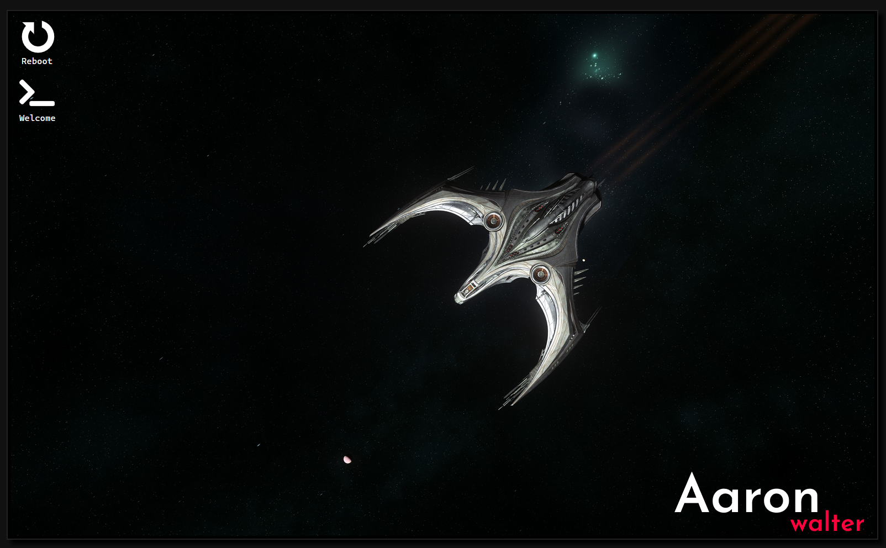

# [awalter.net](https://awalter.net)
My website. There isn't much here yet.

## Powered by
* Vue
* Webpack
* TypeScript
* SASS
* Pain

## Usage
1. Run 'npm install'
1. Run 'npm run dev', 'npm run watch', or 'npm run prod' depending on what you want to do
1. Point your webserver at the public directory
1. Bam, you're in

## Screenshot

